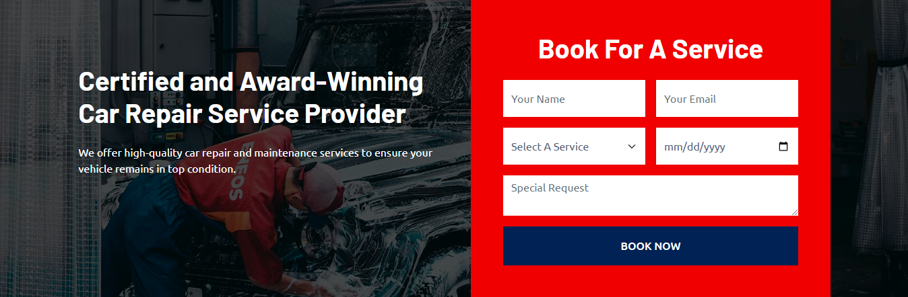

## Sasik Service Station Website Using React + Firebase

A React website built for Qualified Car Repair Service Center, This project showcasing UI design and functionality and designed to be lightweight


---

### Home Page


---

### Booking Page



### Getting Started

Follow these steps to run the project locally.

### Prerequisites
- **Node.js** (LTS version recommended)
- **npm** or **yarn** installed on your machine

### Installation

```bash
# 1. Clone the repository
git clone https://github.com/saveen99/sasik-car-care.git
cd sasik-car-care

# 2. Install dependencies
npm install

# 3. Run the development server
npm run dev

# 4. Open the app in your browser at:
# http://localhost:3000

```
## License

This project is licensed under the **MIT License** - see the [LICENSE](LICENSE) file for details.

